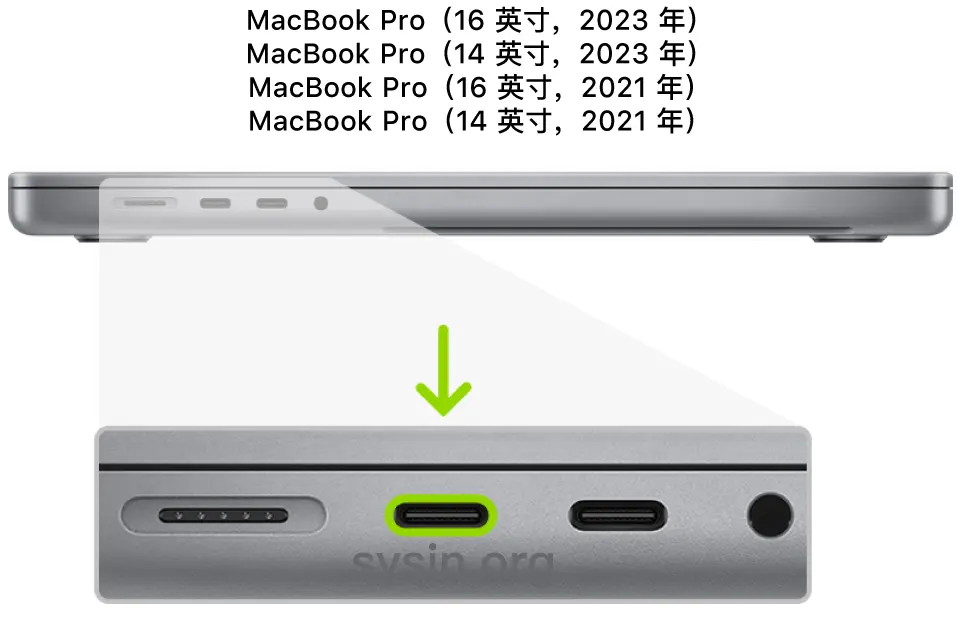

## MacOS Ventura/MacOS Sonoma 刷机
MacOS13之后的Mac如果被监管会被禁止进入Recovery Mode，无法和MacOS13版本以下的Mac以同样方法直接卸载磁盘。需要在DFU（Device Firmware Upgrade）模式下安转MacOS12或以下的系统
并且如果软件更新到MacOS13及以上，会让没有加入监管系统的Mac，强制加入监管系统（每10分钟跳一次弹窗）需要删除配置文件

## 刷机前的准备
1. 一台可以正常使用的Mac电脑
2. USB-C 数据线
如果需要，建议使用时间机器备份

---
## 开始刷机
为了易于理解，可以把被刷机的电脑称为电脑A，正常使用的电脑称为电脑B

电脑B需要先安装Apple Configurator

然后用数据线连接两台电脑，需要注意的是，数据线连接的C口有着严格的要求
在这里会对Macbook Air，Macbook Pro的连接方式详细介绍，其他机型可以自己上网查询
>搭载 Apple 芯片的 14 英寸或 16 英寸 MacBook Pro 的左侧，显示靠后的两个雷雳 4 (USB-C) 端口，其中高亮标记了最左侧的端口

---
>MacBook Air的左侧，显示靠后的两个雷雳 3 (USB-C) 端口，其中标出了最左侧的端口。

---

简单的来说，对于搭载Apple Silicon的Macbook机型，数据线需要连接上面的C口

### 进入DFU模式
在连接数据线之后，把电脑A完全关机，建议在关机后至少等待10秒。

按下电源按钮。
按住电源按钮的同时，按下以下所有三个按键大约 10 秒钟：
1. 右 Shift 键
2. 左 Option 键
3. 左 Control 键

10 秒钟后，立即松开这三个按键但继续按住电源按钮，直至设备出现在 Apple Configurator 2 中。
当DFU模式启动成功，在电脑B上会出现DFU的大图标，如下图：

---
第一次进入DFU模式很有可能失败，所以需要多尝试几次
---
如果 Mac A尚未启动到 DFU 模式，Mac B显示如下：

---
如果 Mac A启动到了恢复模式选择窗口, Mac B显示如下：

这种情况需要完全关机后重新尝试
---
---
---
---

